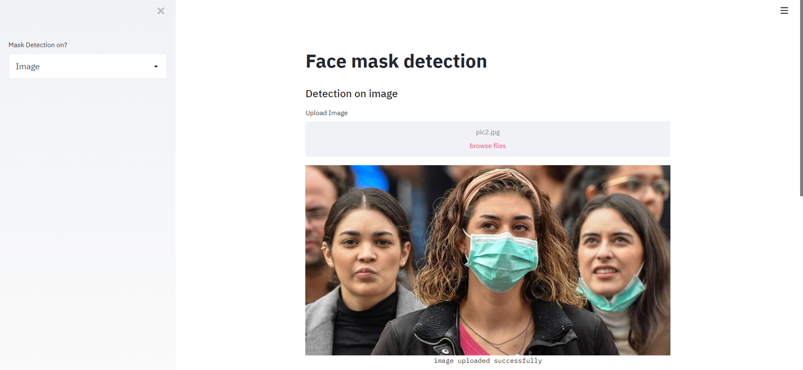

<h1 align="center">Face Mask Detection</h1>

  <h4>Face Mask Detection system built with OpenCV, Keras/TensorFlow using Deep Learning and Computer Vision concepts in order to detect face masks in static images as well as in real-time video streams.</h4>
</div>


## Motivation
In the present scenario due to Covid-19, there is no efficient face mask detection applications which are now in high demand for transportation means, densely populated areas, residential districts, large-scale manufacturers and other enterprises to ensure safety. Also, the absence of large datasets of __‘with_mask’__ images has made this task more cumbersome and challenging. 


## TechStack/framework used

- [OpenCV](https://opencv.org/)
- [Caffe-based face detector](https://caffe.berkeleyvision.org/)
- [Keras](https://keras.io/)
- [TensorFlow](https://www.tensorflow.org/)
- [MobileNetV2](https://arxiv.org/abs/1801.04381)

## Features
Our face mask detector didn't use any morphed masked images dataset. The model is accurate, and since we used the MobileNetV2 architecture, it’s also computationally efficient and thus making it easier to deploy the model to embedded systems (Raspberry Pi, Google Coral, etc.).

This system can therefore be used in real-time applications which require face-mask detection for safety purposes due to the outbreak of Covid-19. This project can be integrated with embedded systems for application in airports, railway stations, offices, schools, and public places to ensure that public safety guidelines are followed.

## Dataset
The dataset used can be downloaded here - [Click to Download](https://github.com/chandrikadeb7/Face-Mask-Detection/tree/master/dataset)

This dataset consists of __4095 images__ belonging to two classes:
*	__with_mask: 2165 images__
*	__without_mask: 1930 images__

The images used were real images of faces wearing masks. The images were collected from the following sources:

* __Bing Search API__ ([See Python script](https://github.com/chandrikadeb7/Face-Mask-Detection/blob/master/search.py))
* __Kaggle datasets__ 
* __RMFD dataset__ ([See here](https://github.com/X-zhangyang/Real-World-Masked-Face-Dataset))

## Prerequisites

All the dependencies and required libraries are included in the file <code>requirements.txt</code> [See here](https://github.com/chandrikadeb7/Face-Mask-Detection/blob/master/requirements.txt)

## 🚀&nbsp; Installation
1. Clone the repo
```
$ git clone https://github.com/hieuleuxuan/Face_Mask_Detection.git
```

2. Change your directory to the cloned repo 
```
$ cd Face_Mask_Detection
```

3. Create a Python virtual environment named 'test' and activate it
```
$ virtualenv test
```
```
$ source test/bin/activate
```

4. Now, run the following command in your Terminal/Command Prompt to install the libraries required
```
$ pip3 install -r requirements.txt
```

## Working

1. Open terminal. Go into the cloned project directory and type the following command:
```
$ python3 train_mask_detector.py --dataset dataset
```

2. To detect face masks in an image type the following command: 
```
$ python3 detect_mask_image.py --image images/pic1.jpeg
```

3. To detect face masks in real-time video streams type the following command:
```
$ python3 detect_mask_video.py 
```
## Results

#### Our model gave 98% accuracy for Face Mask Detection after training via <code>tensorflow-gpu==2.5.0</code>

<a href="https://colab.research.google.com/drive/1AZ0W2QAHnM3rcj0qbTmc7c3fAMPCowQ1?usp=sharing"></a>
####          


#### We got the following accuracy/loss training curve plot


## Streamlit app

Face Mask Detector webapp using Tensorflow & Streamlit

command
```
$ streamlit run app.py 
```
## Images

<p align="center">
  
</p>
<p align="center">Upload Images</p>

<p align="center">
  
</p>
<p align="center">Results</p>

## Cited by:

1. https://osf.io/preprints/3gph4/
2. https://link.springer.com/chapter/10.1007/978-981-33-4673-4_49
3. https://ieeexplore.ieee.org/abstract/document/9312083/
4. https://link.springer.com/chapter/10.1007/978-981-33-4673-4_48
5. https://www.researchgate.net/profile/Akhyar_Ahmed/publication/344173985_Face_Mask_Detector/links/5f58c00ea6fdcc9879d8e6f7/Face-Mask-Detector.pdf


## Internet of Things Device Setup

### Expected Hardware
* [Raspberry Pi 4 4GB with a case](https://www.canakit.com/raspberry-pi-4-4gb.html)
* [5MP OV5647 PiCamera from Arducam](https://www.arducam.com/docs/cameras-for-raspberry-pi/native-raspberry-pi-cameras/5mp-ov5647-cameras/)

### Getting Started
* Setup the Raspberry Pi case and Operating System by following the Getting Started section on page 3 at `documentation/CanaKit-Raspberry-Pi-Quick-Start-Guide-4.0.pdf` or https://www.canakit.com/Media/CanaKit-Raspberry-Pi-Quick-Start-Guide-4.0.pdf
  * With NOOBS, use the recommended operating system
* Setup the PiCamera
  * Assemble the PiCamera case from Arducam using `documentation/Arducam-Case-Setup.pdf` or https://www.arducam.com/docs/cameras-for-raspberry-pi/native-raspberry-pi-cameras/5mp-ov5647-cameras/
  * [Attach your PiCamera module to the Raspberry Pi and enable the camera](https://projects.raspberrypi.org/en/projects/getting-started-with-picamera/2)

### Raspberry Pi App Installation & Execution

> Run these commands after cloning the project

| Commands                                                                                                                     | Time to completion |
|------------------------------------------------------------------------------------------------------------------------------|--------------------|
| sudo apt install -y libatlas-base-dev liblapacke-dev gfortran                                                                | 1min               |
| sudo apt install -y libhdf5-dev libhdf5-103                                                                                  | 1min               |
| pip3 install -r requirements.txt                                                                                             | 1-3 mins           |
| wget "https://raw.githubusercontent.com/PINTO0309/Tensorflow-bin/master/tensorflow-2.4.0-cp37-none-linux_armv7l_download.sh" | less than 10 secs  |
| ./tensorflow-2.4.0-cp37-none-linux_armv7l_download.sh                                                                        | less than 10 secs  |
| pip3 install tensorflow-2.4.0-cp37-none-linux_armv7l.whl                                                                     | 1-3 mins           |

---

